# Stockroom · Inventory Management

An inventory directory and multi-step product onboarding wizard built on the
[DummyJSON](https://dummyjson.com/docs/products) products API.

| | |
| --- | --- |
| **Live demo** | _Add the Vercel production URL here after deploying (see [Deployment](#deployment))._ |
| **Repository** | _Add the public GitHub URL here after pushing._ |

**Stack:** Next.js 16 (App Router) · React 19 · TypeScript (strict) · Redux Toolkit + RTK Query ·
React Hook Form + Yup · Tailwind CSS v4 (no UI component libraries) · Vitest + React Testing Library + MSW.

---

## Screenshots

| Inventory, table view | Inventory, card view |
| --- | --- |
| 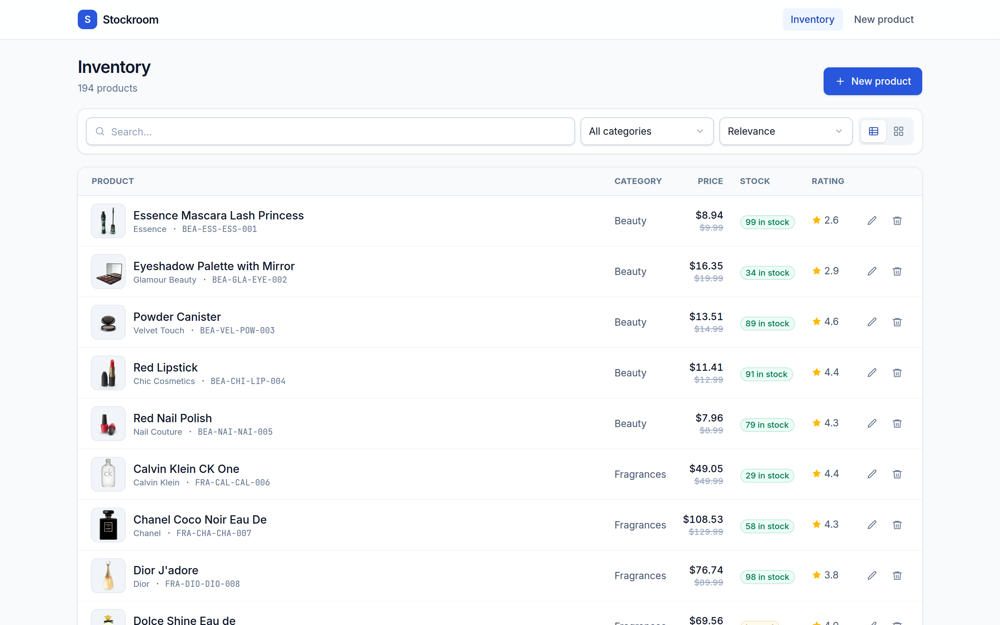 | 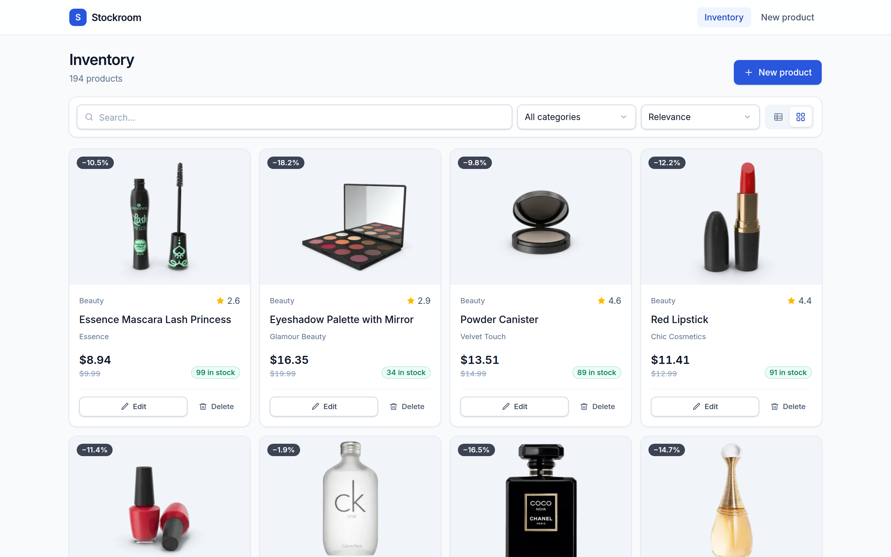 |
| **Search + category + sort, synced to the URL** | **Optimistic delete rolled back, with Retry** |
| 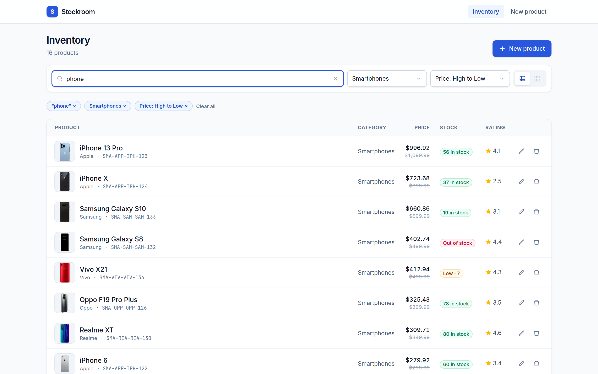 | 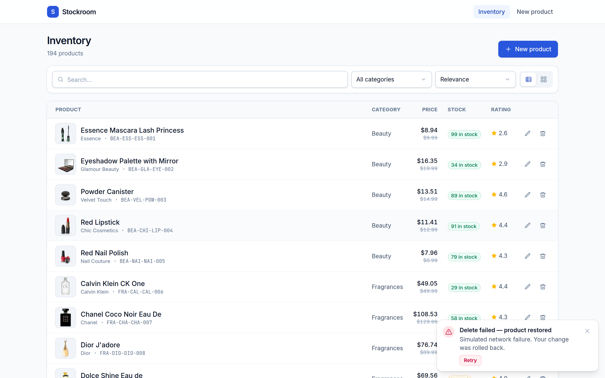 |
| **Skeleton loading** | **Empty state** |
| 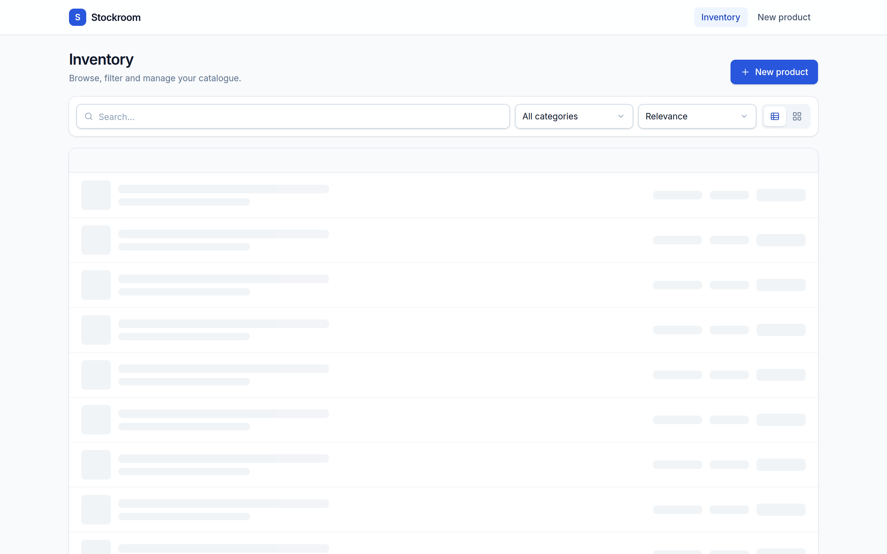 | 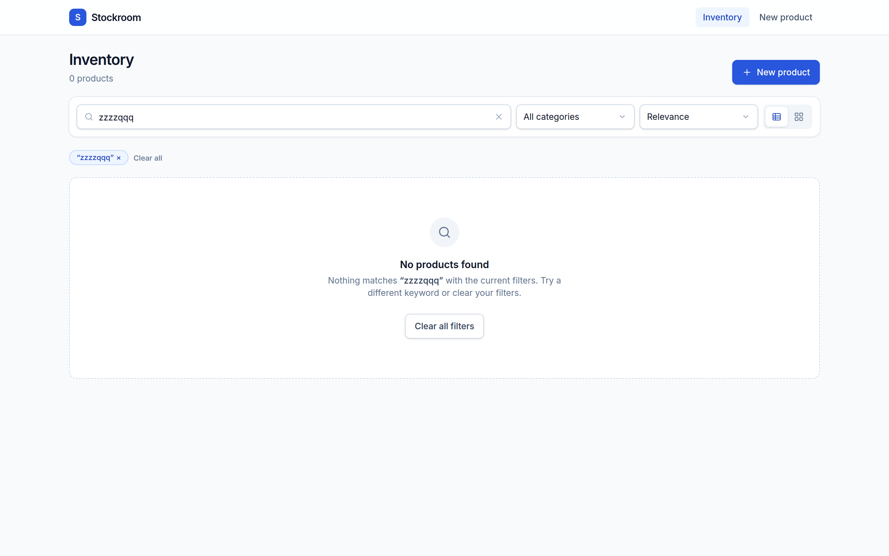 |
| **Optimistic edit dialog** | **Product detail (Server Component)** |
| 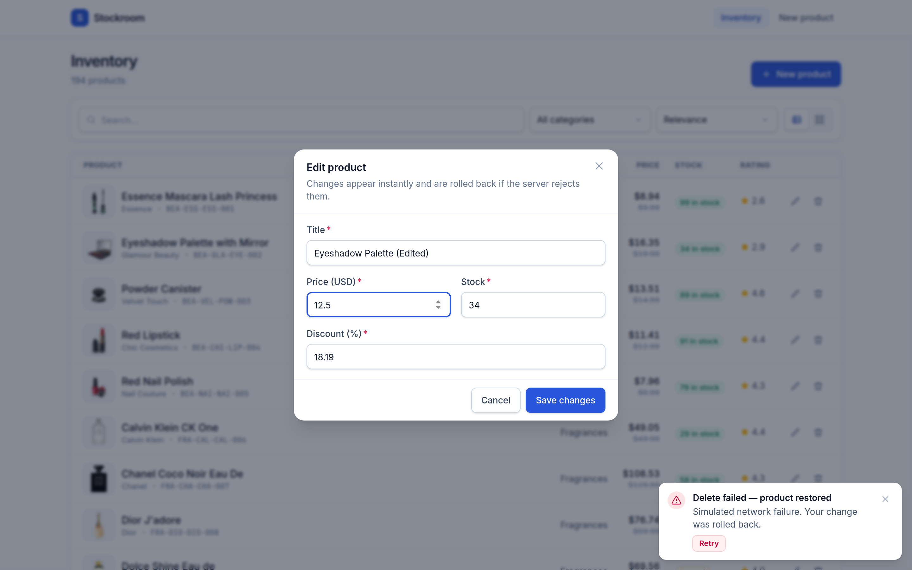 | 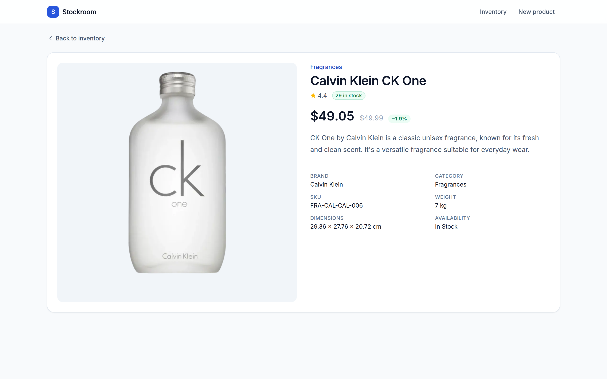 |

| Mobile list | Mobile filter drawer |
| --- | --- |
| 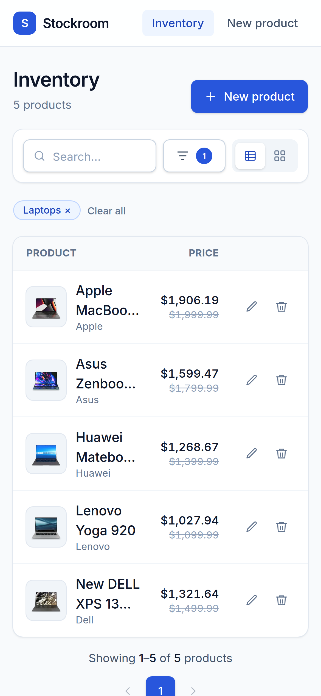 | 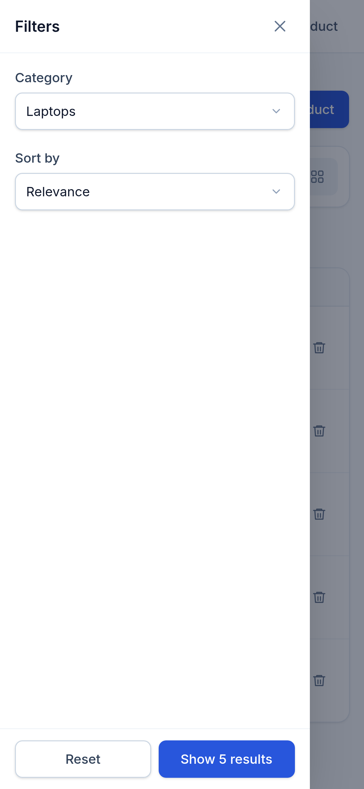 |

| Wizard: step validation | Wizard: SKU variations with duplicate check |
| --- | --- |
| 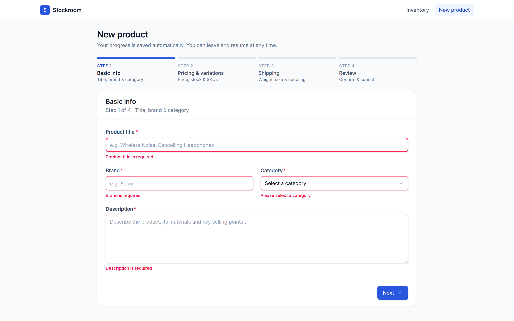 | 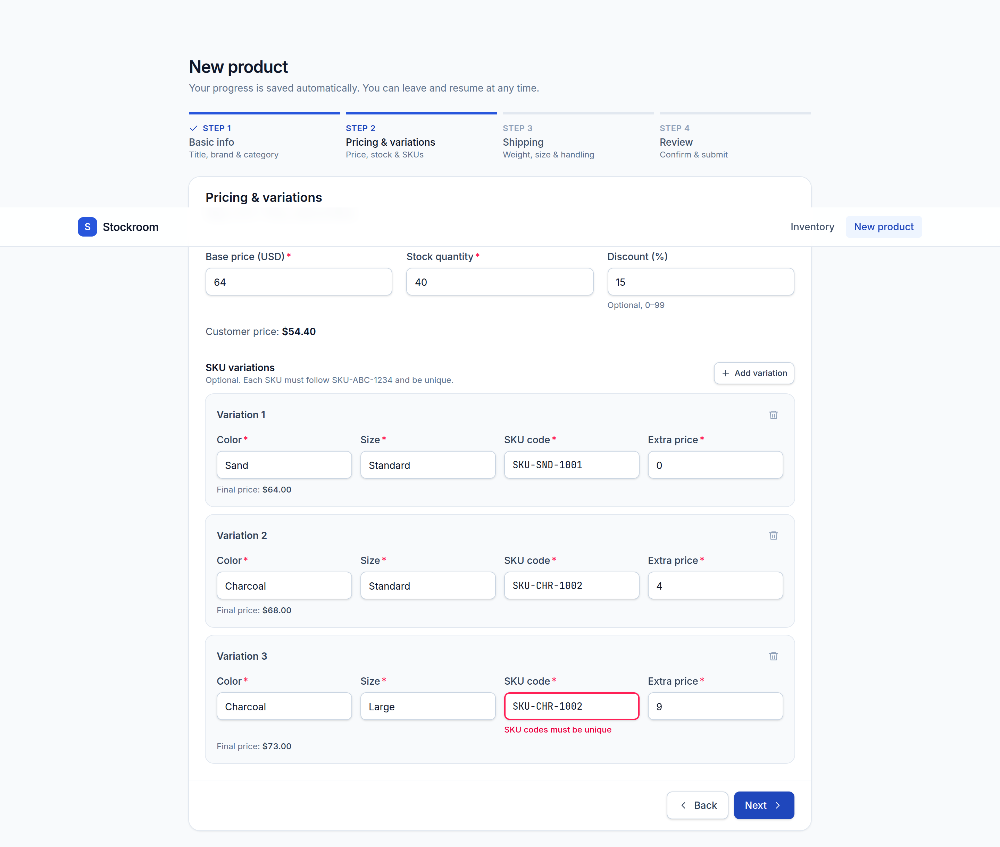 |
| **Wizard: conditional fragile handling** | **Wizard: review with Edit shortcuts** |
| 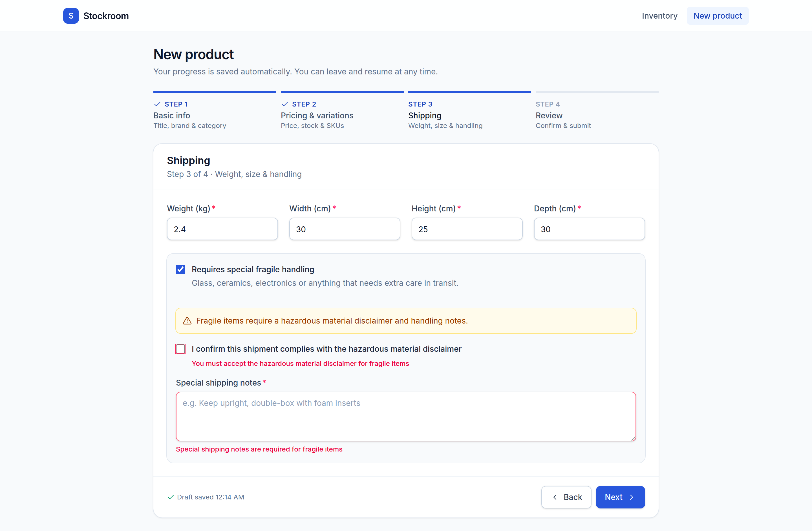 | 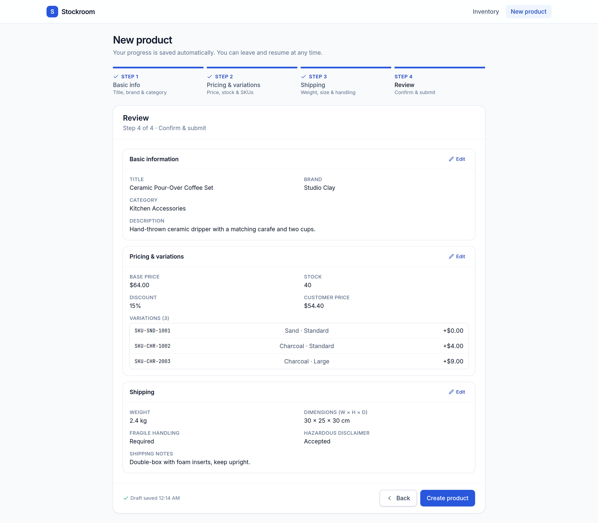 |
| **Refresh mid-wizard: resume prompt** | **Submitted** |
| 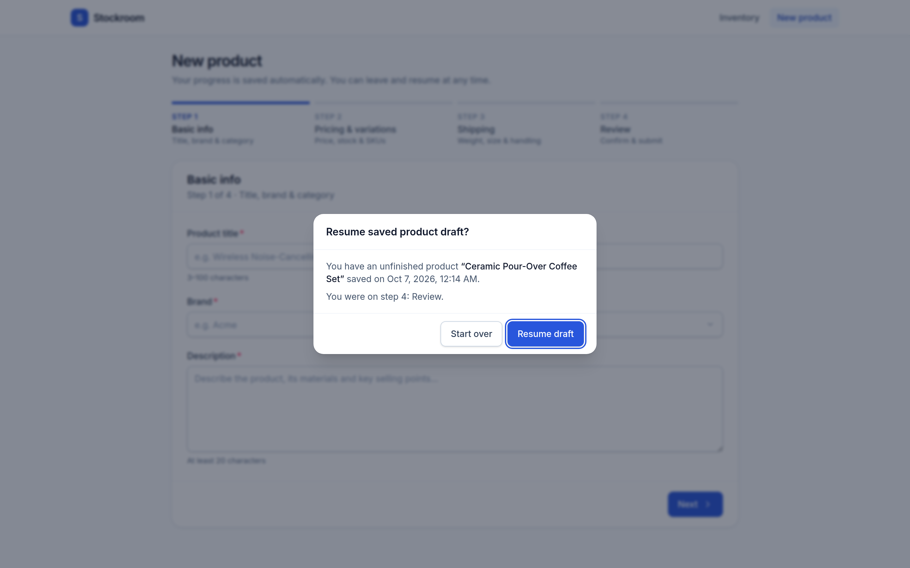 | 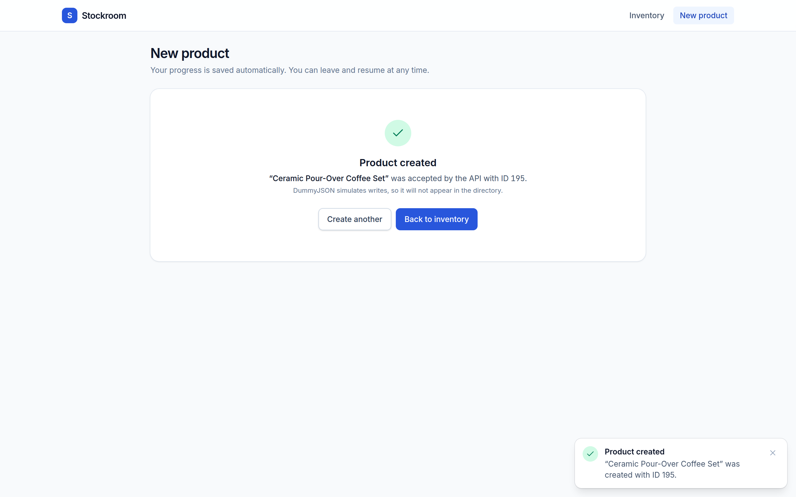 |

---

## Getting started

Requires **Node.js 20.9+** (developed on Node 22).

```bash
npm install          # install dependencies
npm run dev          # start the dev server on http://localhost:3000
npm run test         # run unit + integration tests once
npm run build        # production build
npm start            # serve the production build
```

Other scripts:

| Script | What it does |
| --- | --- |
| `npm run test:watch` | Vitest in watch mode |
| `npm run test:coverage` | Tests with a V8 coverage report (fails under 80%) |
| `npm run typecheck` | Generates Next.js route types, then runs `tsc --noEmit` |
| `npm run lint` | ESLint (Next.js + TypeScript rules, `no-explicit-any` as an error) |

### Configuration

No environment variables are required. One is optional:

| Variable | Default | Purpose |
| --- | --- | --- |
| `NEXT_PUBLIC_SIMULATED_FAILURE_RATE` | `0.2` | Probability (0 to 1) that a `PUT`/`DELETE` request fails on purpose, to exercise rollback. Set to `0` to turn it off or `1` to always fail. |

---

## Features

### 1. Inventory directory (`/products`)

- **3-way sync.** Search, category, sort and page live in Redux, in the URL
  (`/products?search=phone&category=smartphones&sort=price_desc&page=2`) and in the RTK Query cache key.
  Refreshing or sharing the link restores the exact view, and back/forward navigation works.
- **Debounced search.** The input updates instantly, but Redux, the URL and the API only change after 300 ms
  of idle typing. Enter commits immediately and Escape clears.
- **Dynamic categories** from `/products/categories`, plus sort by price, name, rating or stock.
- **Optimistic edit and delete.** The UI changes before the request completes. A 20% simulated failure rate
  (on top of real errors) rolls the cache back and shows an error toast with **Retry**.
- **Tailwind UI.** Custom table and card layouts with a toggle that is remembered, skeleton loading, empty and
  error states, active-filter chips, fixed-width pagination, and an accessible slide-out filter drawer on mobile
  (focus trap, Escape to close, scroll lock).
- **Product detail page** (`/products/[id]`), rendered as a Server Component with Next.js data-cache
  revalidation, `generateMetadata`, `loading.tsx` and `not-found.tsx`.

> DummyJSON only *simulates* writes. Successful edits and deletes therefore stay applied only in the
> client cache, and created products (id 195+) are never persisted.

### 2. Product wizard (`/products/new`)

Four steps on a single React Hook Form instance, validated by one composed Yup schema:

1. **Basic info.** Title (3 to 100 characters), brand, category (loaded from the API), description (20+ characters).
2. **Pricing & variations.** Price > 0, integer stock ≥ 0, optional discount 0 to 99, and a `useFieldArray` of
   SKU variations. Each SKU must match `SKU-[A-Z]{3}-[0-9]{4}`, and a custom Yup test rejects duplicates,
   attaching the error to the offending row.
3. **Shipping.** Weight and dimensions > 0. Checking *fragile handling* reveals a hazardous-material disclaimer
   and shipping notes (10+ characters), which become mandatory through `yup.when`.
4. **Review.** A summary of every step with **Edit** buttons that jump back without losing data.

Each step is validated with `trigger(stepFields)` before moving on. Progress is autosaved (debounced) to Redux
and `localStorage`. After a refresh or tab close, the user sees **"Resume saved product draft?"** and can
resume or start over. Submission goes through a `createAsyncThunk` that calls `POST /products/add`.

### 3. Tests

**160 tests in 18 files.** Coverage is measured on validation schemas, helpers, Redux slices and the store:

| Statements | Branches | Functions | Lines |
| --- | --- | --- | --- |
| 97.4% | 93.3% | 98.0% | 98.1% |

- **Yup schemas.** SKU format and duplicates, price/stock/discount bounds, fragile conditional rules, and the
  composed schema.
- **Redux.** Filter reducers and selectors, toast and UI slices, draft reducers, the `submitProduct` thunk, draft
  persistence through listener middleware, and optimistic update/delete rollback against a real store and cache,
  including stale-request handling.
- **Integration (RTL + MSW).** The full wizard flow, with the intercepted `POST /products/add` body asserted
  field by field, API failure handling, draft resume, discard and autosave. Directory tests cover URL restore,
  debounced search (exactly one request), protection against stale responses, category filtering, pagination
  with back navigation, optimistic delete rollback plus Retry, optimistic edit, layout toggle, mobile drawer
  and error state.

MSW handlers in [src/test/msw/handlers.ts](src/test/msw/handlers.ts) mirror DummyJSON's search, category,
paging and sorting semantics.

---

## Project structure

```text
src/
├── app/                      # App Router: layouts, pages, loading/error/not-found boundaries
│   └── products/             # /products, /products/new, /products/[id]
├── components/               # Pure Tailwind primitives: Button, Modal, Drawer, Toaster, form fields, icons
├── features/
│   ├── products/             # Directory UI, URL-sync hook, filters + optimistic slices, edit schema
│   ├── wizard/               # Wizard steps, Yup schemas, draft slice + storage, payload mapper
│   └── ui/                   # View mode / drawer slice, toast slice
├── hooks/                    # useOverlay (focus trap etc.), useDebouncedValue
├── lib/
│   ├── api/                  # RTK Query API, failure-simulating base query, guards, errors, server fetch
│   ├── filters/              # URL <-> filter parsing, request builder, pagination helpers
│   └── utils/                # Formatting, debounce
├── store/                    # combineSlices root reducer, listener middleware, typed hooks, provider
└── test/                     # Vitest setup, MSW server/handlers, fixtures, render helpers
```

---

## Technical rationale & architecture

### 1. Race conditions while typing into search

Several layers each remove a class of race:

1. **Debounce at the source.** The search box keeps its own local state for instant feedback. Only a
   300 ms debounced commit dispatches `searchChanged` to Redux. Typing "phone" quickly sends one request,
   not five, which the integration test asserts.
2. **Responses are keyed by their arguments.** The query argument *is* the filter object, and RTK Query stores
   every argument set in its own cache entry. A slow response for `q=iph` can only ever land in the
   `q=iph` entry. It can never overwrite the entry for `q=iphone`.
3. **Render only the current arguments' data.** The directory renders `currentData`, which RTK Query exposes
   only for the hook's *current* arguments, rather than `data`, which can hold the previous arguments' result.
   Even if an older request resolves last, it is never displayed against the new filters. A test makes the
   first search deliberately slower than the second and asserts the stale result never appears.
4. **No duplicate in-flight requests.** RTK Query de-duplicates identical concurrent queries. Revisiting a
   term within `keepUnusedDataFor` is served from cache.
5. **No URL write-back race.** URL to Redux sync uses an idempotent reducer, so our own `pushState` echoing
   back through `useSearchParams` is a no-op. On mount, the query is skipped until Redux has been hydrated
   from the URL, so the default page is never fetched before the requested one. The hydration flag is reset
   on unmount, so stale filters from a previous visit are never pushed into a fresh URL.

### 2. State distribution boundaries

Each kind of state lives in exactly one owner:

| State | Owner | Why |
| --- | --- | --- |
| Server data: products, categories, single product | **RTK Query cache** | Caching, de-duplication, invalidation, loading/error flags and optimistic patches come built in. Copying server data into slices would create a second source of truth. |
| View state that must survive refresh or sharing: search, category, sort, page | **Redux `filters` slice, mirrored to the URL** | Many components read it: toolbar, drawer, chips, pagination, query. The URL is the persistence and sharing layer, and the memoised filter object doubles as the cache key. |
| UI-only client state: layout, drawer open, toasts, optimistic bookkeeping | **Redux slices** | Cross-cutting and serialisable. Toasts carry a serialisable retry descriptor rather than a function. |
| Wizard draft and submission status | **Redux `draft` slice + localStorage** (via listener middleware) | Outlives the form component for resume-after-refresh, and is observable and testable. |
| In-progress field values, touched/dirty flags, validation errors | **React Hook Form** | Uncontrolled inputs keep keystrokes out of Redux and out of React renders. Pushing every keystroke through Redux would re-render subscribers on each key. |

Redux only receives **debounced snapshots** of the form for drafts, and React Hook Form only receives a draft
back when the user explicitly resumes. Those snapshots are deep copies on purpose.
`getValues()` returns React Hook Form's live internal object, and Redux Toolkit freezes whatever it stores.
Sharing the reference made the form read-only after the first autosave. A regression test now covers it.

### 3. Re-render optimisation in the SKU field array

- **Stable keys.** Rows are keyed by `field.id` from `useFieldArray`, never by index, so adding or removing a
  row does not remount or re-render its siblings.
- **Memoised rows with stable props.** `VariationRow` is wrapped in `React.memo` and receives only
  referentially stable props: `control`, `register`, and `useCallback`-wrapped `onRemove`/`onSkuBlur`.
- **Path-scoped subscriptions.** Each row reads its own errors with
  `useFormState({ control, name: \`variations.${index}\` })`, so a validation change in one row re-renders
  only that row. The live "final price" preview is a separate leaf that subscribes to just two fields through
  `useWatch`.
- **Uncontrolled inputs.** `register` keeps keystrokes in the DOM. No input in the array is a controlled React
  value, so typing does not re-render the wizard.
- **No top-level `watch()`.** The wizard container never calls `watch()` in render. Autosave uses the
  `subscribe` API, which runs outside React's render cycle, and the review step reads a one-off
  `getValues()` snapshot. Conditional UI such as the fragile section subscribes in a small child component.
- **Targeted cross-row validation.** Duplicate SKU checks span rows, so when a SKU loses focus only the
  non-empty SKU paths are re-validated. This avoids validating, and re-rendering, the whole form.

### 4. Rollback for optimistic updates

The rollback lives in the RTK Query endpoints in [src/lib/api/productsApi.ts](src/lib/api/productsApi.ts):

1. In `onQueryStarted`, the mutation finds every cached `getProducts` entry
   (`selectCachedArgsForQuery`) plus the `getProduct(id)` entry. It applies the change with
   `updateQueryData`, which removes the row and decrements `total` for a delete.
2. Each `updateQueryData` dispatch returns a patch result holding Immer's **inverse patches**.
3. `await queryFulfilled`. On failure, whether a real HTTP error or the simulated 20% failure from the custom
   base query, every patch's `undo()` runs, restoring each cache entry exactly as it was.
4. Side effects are decoupled from the cache logic. An `optimistic` slice tracks each write as `pending`,
   cleared, or `rolledBack` through RTK Query matchers keyed by `requestId`, so a late failure from a
   superseded request cannot flag a newer successful one. Listener middleware turns rejections into error
   toasts with a serialisable retry descriptor, and **Retry** simply re-dispatches the same mutation, which
   is optimistic again.
5. Because DummyJSON does not persist writes, successful mutations intentionally do **not** invalidate tags.
   A refetch would restore the server's unchanged data and look like a rollback.

The failure simulation sits in the base query, outside the UI, so tests can make it deterministic
(`rate = 0` or `1`). The rate can also be configured per deployment with
`NEXT_PUBLIC_SIMULATED_FAILURE_RATE`.

---

## Other implementation notes

- **Search combined with category.** DummyJSON cannot filter a search by category. In that one case the app
  fetches all search hits (`limit=0`) and filters and paginates on the client. Every other combination is
  paginated server-side, and list requests use `select=` to fetch only the fields the directory renders.
- **Next.js performance APIs.** The products page is a static Server Component shell with the interactive
  directory behind a `Suspense` boundary. URL updates use the native History API, which Next integrates with
  `useSearchParams`, so filtering never causes a server round-trip. Other techniques used: `next/image` with
  responsive `sizes`, `next/font`, `next/dynamic` for the edit dialog and the client-only wizard, React
  `cache()` to dedupe the detail-page fetch, and time-based revalidation.
- **Type safety.** `strict` and `noImplicitAny` are on, along with unused-variable checks, and ESLint
  forbids `any`. API responses are checked with type guards rather than cast.
- **Accessibility.** Labelled controls, `aria-invalid` and `aria-describedby` on fields, focus-trapped
  dialogs and drawer, `aria-current` on pagination and stepper, live regions for toasts and autosave status,
  and support for `prefers-reduced-motion`.

---

## Deployment

The app needs no environment variables, so Vercel's defaults work:

1. Push this repository to a public GitHub repository.
2. In Vercel, choose **Add New → Project**, import the repository, keep the detected Next.js settings and deploy.
   Alternatively, run `npx vercel --prod` from the project root.
3. Put the production URL and repository URL in the table at the top of this README.
